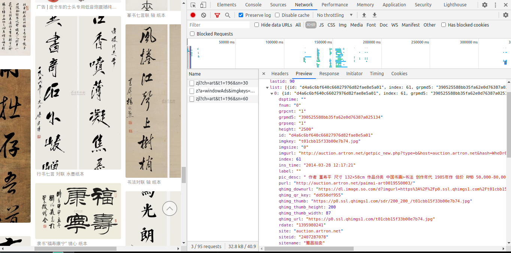

# 360images
360图片的爬虫(scrapy实现)

> 需求:将360图片的艺术分类下面的书法图片爬取到本地

## 网页分析:

360图片的图片内容是动态加载的，一次只加载30张，下滑窗口后会加载新的30张图片，查看抓包工具的ajax请求：
- https://image.so.com/zjl?ch=art&t1=196&sn=30
- https://image.so.com/zjl?ch=art&t1=196&sn=60



分析请求:

ch 表示一级分类(艺术、搞笑、美女等)，t1表示二级分类(书法、绘画、玉石等), sn表示分页(初始值为0,按30递增).

请求返回的响应数据是json格式数据:
- list字段存放所有图片的数据:
    - pic_desc:存放图片的描述信息
    - qhimg_url:存放图片url
    - qhimg_downurl:存放图片的下载地址
    
经测试,qhimg_url获取的图片和qhimg_downurl下载的图片是一样的,所以解析qhimg_url的数据就行了


## 爬虫编写:

- 创建爬虫项目:
    - `scrapy startproject soimgPro`
- 新建爬虫:
    - `cd soimgPro `
    - `scrapy genspider soimg https://image.so.com/`
    - 注释爬虫文件的start_urls和allowed_domains
- 编写爬虫:
    - 编写Item封装数据:
    ```
    class ImgItem(Item):
        urls = Field()
    ```
    - 爬虫入口，解析数据:
        - 根据url规律:https://image.so.com/zjl?ch=art&t1=196&sn=30 ，编写通用的url:
            - `self.url = "https://image.so.com/zjl?ch=art&t1=196&sn=%s"`
        - 用于生成下一个请求的数:
            - `self.start_index = 0`
        - 生成入口url
            - `start_urls = [url % 0]`
        - 设置最大爬取条数:
            - 限制最大下载量，避免磁盘用量过大:`self.MAX_NUM = 1000`
        - 编写parse方法，提取图片url和发起下一页的请求:
        ```python
        def parse(self, response):
            json_dict = response.json()
            img_url_list = [li['qhimg_url'] for li in json_dict['list']]
            item = ImgItem()
            item['urls'] = img_url_list
            yield item
            self.start_index += json_dict['count']
            if json_dict['count'] > 0 and self.start_index < MAX_NUM:
                yield scrapy.Request(self.url % self.start_index)
         ```
    - 编写FilePpelines下载数据:
    ```python
    import scrapy
    from scrapy.pipelines.images import ImagesPipeline
    class SoimgproPipeline(ImagesPipeline):
        def file_path(self, request, response=None, info=None, *, item=None):
            return request.url.split('/')[-1]
        
        def get_media_request(self, item, info):
                for url in item['urls']:
                    yield scrapy.Request(url)

        def item_completed(self, results, item, info):
                return item
    ```
    - 修改settings.py:
        - `LOG_INFO = "ERROR"`: 错误才打印
        - `IMAGES_STORE='./soimgs'`:图片下载到当前目录的soimgs目录下
        - `ITEM_PIPELINES = {'soimgPro.pipelines.SoimgproPipeline': 300,}`:启用pipeline
- 启动爬虫:
    - `scrapy crawl soimg`

## 遇到的问题:

- ImagesPipeline需要pillow模块，之前的环境已经安装过了，所以这次没有注意，还调试了半天
    - 在代码编写阶段的调试就将LOF_INFO设置为"`DEBUG"`或者不设置(默认是DEBUG)
    - DEBUG打印的信息里会有相关提示
